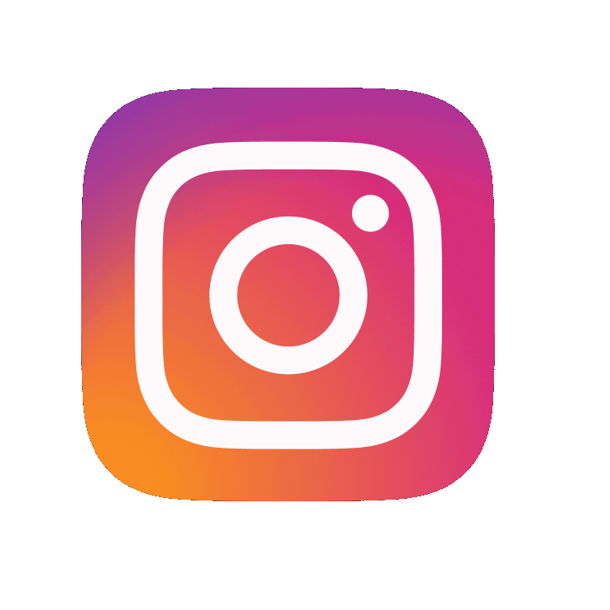
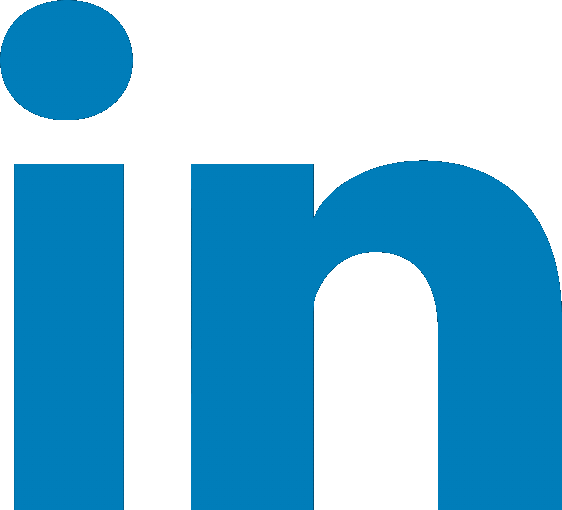
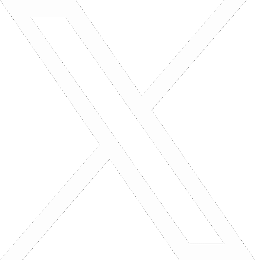
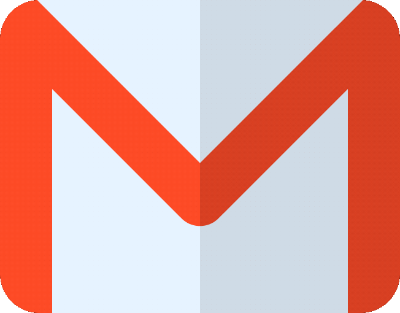

  

# 💫 About Me:
🔭 I’m currently working on AI-powered caption generator peoject 🧑‍🤝‍🧑 I’m looking to collaborate on AI, design & creative technology   🤝 I’m looking for help with exploring new workflows & tools   🌱 I’m currently learning generative AI, creative design & motion design   💬 Ask me about visual design, AI tools, branding & motion   ⚡ Fun fact: I started in the kitchen and somehow ended up building things with AI

## 🌐 Socials:

  
  &nbsp;&nbsp;
  
  &nbsp;&nbsp;
  
  &nbsp;&nbsp;
  
  &nbsp;&nbsp;
  

 

# 💻 Tools:
       
# 📊 GitHub Stats:

 

### ✍️ Random Dev Quote

